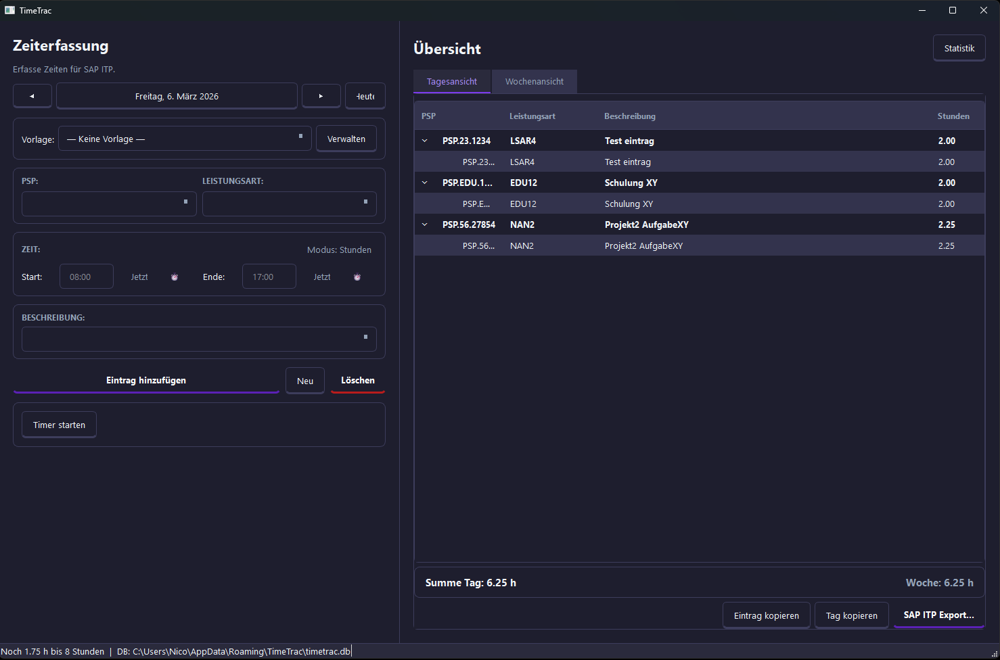
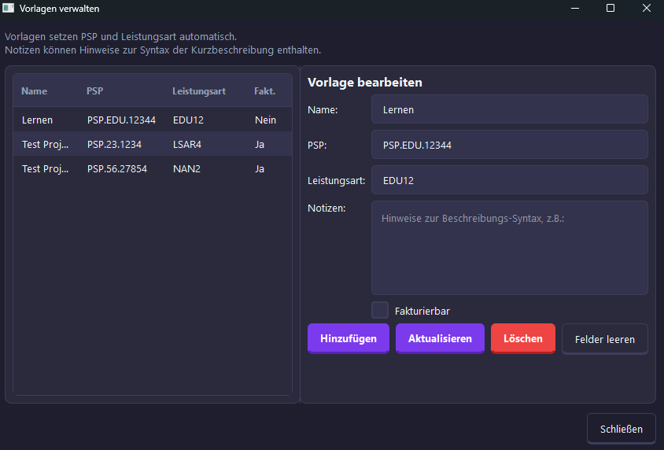
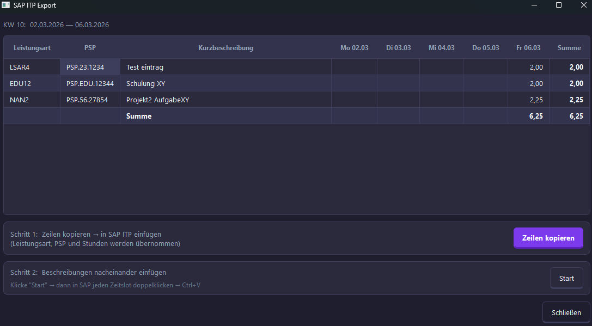
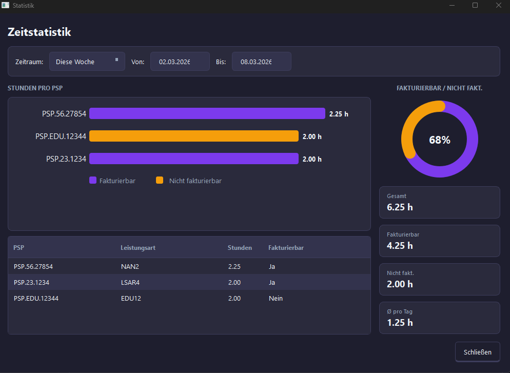

# TimeTrac

[](https://github.com/Nico-dhls/timetrac/actions/workflows/build-and-sign.yml)
[](https://github.com/Nico-dhls/timetrac/actions/workflows/tests.yml)

TimeTrac ist eine Desktop-Zeiterfassung, die speziell auf den Workflow mit **SAP GUI ITP** zugeschnitten ist. Zeiten werden lokal erfasst, gruppiert und per Zwischenablage in SAP eingefuegt.



## Funktionen

### Zeiterfassung
- Tagesbasierte Erfassung mit Kalendernavigation und Wochentagsanzeige
- Wahlweise Eingabe per **Start-/Endzeit** oder **Stundenzahl** (Modus umschaltbar)
- Integrierter Timer zum Messen der Arbeitszeit
- Gruppierte Darstellung nach PSP, Leistungsart und Beschreibung
- Tages- und Wochensummen auf einen Blick
- Tastaturkuerzel: `Ctrl+N` (Neu), `Ctrl+S` (Speichern), `Ctrl+T` (Timer)

### Vorlagen (Presets)
Haeufig genutzte Kombinationen aus PSP und Leistungsart lassen sich als Vorlagen speichern. Optional koennen Notizen hinterlegt werden (z.B. kundenspezifische Syntax fuer Kurzbeschreibungen). Jede Vorlage kann als **Fakturierbar** oder **Nicht fakturierbar** markiert werden.



### SAP ITP Export
Der zweistufige Export-Dialog bereitet die Wochendaten fuer SAP GUI ITP auf:
1. **Zeilen kopieren** -- Leistungsart, PSP und Stunden pro Wochentag werden als Tab-separierte Zeilen in die Zwischenablage kopiert und koennen direkt in SAP eingefuegt werden.
2. **Beschreibungen einfuegen** -- Kurzbeschreibungen werden nacheinander in die Zwischenablage geladen. In SAP den jeweiligen Zeitslot doppelklicken und mit `Ctrl+V` einfuegen.



### Statistik
Auswertung der gebuchten Stunden pro PSP mit Aufschluesselung nach Fakturierbar / Nicht fakturierbar. Der Zeitraum ist waehlbar: aktuelle Woche, aktueller Monat oder benutzerdefiniert.



## Installation

### Windows MSI (empfohlen)
Lade die aktuelle MSI-Datei von der [Releases-Seite](https://github.com/Nico-dhls/timetrac/releases) herunter und installiere sie. TimeTrac wird unter `%AppData%\TimeTrac` installiert und legt eine Desktop-Verknuepfung an.

### Aus Quellcode
```bash
python -m venv .venv
source .venv/bin/activate  # Windows: .venv\Scripts\activate
pip install -r requirements.txt
python main.py
```

## Datenspeicherung

Alle Daten werden in einer lokalen SQLite-Datenbank gespeichert:
- **Windows:** `%AppData%\TimeTrac\timetrac.db`
- **macOS:** `~/Library/Application Support/TimeTrac/timetrac.db`
- **Linux:** `~/.local/share/TimeTrac/timetrac.db`

Beim ersten Start werden vorhandene Daten aus dem alten `time_entries.json`-Format automatisch migriert.

## Build

Der GitHub-Workflow **Build and Sign MSI** erstellt mit cx_Freeze eine MSI-Installationsdatei und signiert sie. Der Workflow wird bei getaggten Releases (`v*`) oder manuell ausgeloest.

Fuer lokale Builds:
```bash
pip install cx_Freeze
python setup.py build_exe
```

## Lizenz
(c) 2025 -- Developed by Nico Dahlhaus.
